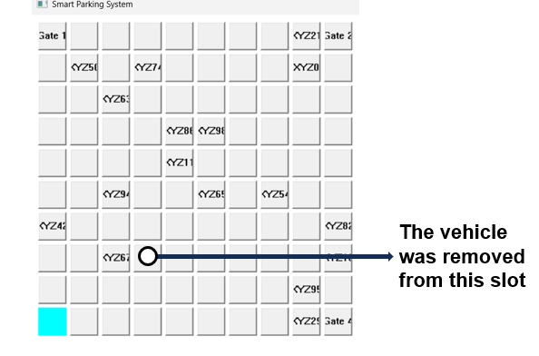
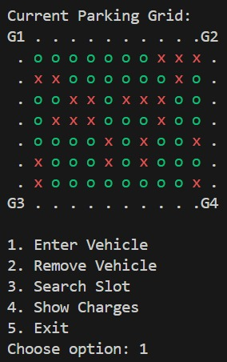

# 🚗 Smart Parking System

A comprehensive **Smart Parking System** implemented in C++ with two operational modes:

- 🖼️ **Graphical (GUI-based)** using **WinAPI**
- 🖥️ **Console-based (CLI)** for terminal/portable use

Both versions simulate a 10x10 smart parking grid with gate-based shortest path logic, vehicle tracking, dynamic occupancy, and activity logging.

---

## 🧩 Project Structure

| File/Folder             | Description                                     |
|-------------------------|-------------------------------------------------|
| `park.cpp`              | Main GUI logic using WinAPI                    |
| `parking_backend.cpp`   | Core logic for slot handling and gate pathing  |
| `parking_backend.h`     | Declarations and constants for backend         |
| `test.cpp`              | Terminal-based version of the parking system   |
| `log.txt`               | Auto-generated log file for entries/exits      |

---

## 🚀 Features

- ✅ Visual 10x10 parking layout (GUI or ASCII grid)
- 🚪 4 Entry/Exit gates (each corner)
- 🚙 Nearest-slot allocation using BFS
- 🅿️ Vehicle tracking by plate number
- 📋 Logging of entry/exit events with timestamps and charges
- 💵 Time-based billing in CLI version

---


## Algorithms Used
- Breadth-First Search (BFS) for nearest-slot pathfinding
- Manhattan Distance for optimal gate selection
- C++ STL: map, queue, chrono, fstream
- Real-time GUI via WinAPI and event loops
- ANSI coloring for CLI grid view (portable and readable)


```bash
g++ park.cpp parking_backend.cpp -o ParkingApp -lgdi32 -mwindows
g++ test.cpp -o Parking
```

## 📸 Screenshots

### 🖼️ GUI View



> Example: Green buttons for available slots, red labels for parked vehicles.

---

### 🚪 Entry/Exit Gates and Dialog Prompt



> Example: Gate buttons placed at the four corners. Input prompt for car number on entry.

---
